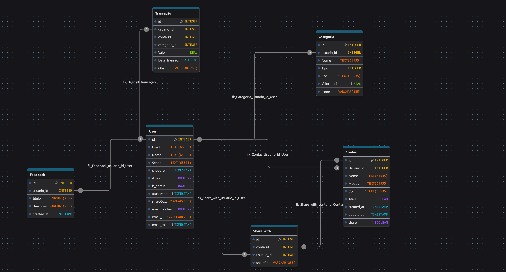

# ShareFin API

API REST responsável pelo gerenciamento financeiro pessoal e compartilhado.

# Stack Tecnológica

## Backend

  

**Node.js**  
Plataforma utilizada para execução da API REST, garantindo alta performance e escalabilidade.

---

## Front-end

  
  
  

**React · Next.js · Tailwind CSS**  
Stack responsável pela interface do usuário, com foco em performance, responsividade e experiência moderna.

---

## Banco de Dados

  
  

**Supabase (PostgreSQL)**  
Utilizado como banco de dados principal e camada de persistência da aplicação.

---

## Deploys
### Backend
  * Render
### Front-End
  * Vercel
### Docs
  * Github Pages

# Diagrama UML

